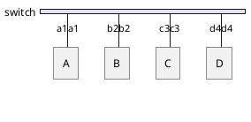
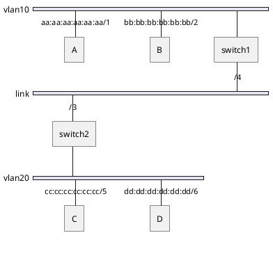

# Switch

A switch is a [[2. Data Link|layer 2]] device whose primary purpose is switching, i.e. moving data **within** networks.
Devices communicating through a switch are in the same network.

## Communication with Switches

Switches use and maintain a MAC address table. It maps the switch ports to specific MAC addresses, allowing it to forward traffic.
Switches perform these 3 tasks:
- **Learn** - update MAC table with map of its port & source MAC.
- **Flood** - duplicate and send frame out all ports (except the initial port that received the frame) to find the target.
- **Forward** - use MAC table to deliver the frame through the appropriate port.

### Example

Let's say we have a switch with hosts connected to its ports:

Initially, the MAC address table starts out empty, because it populates the table as data flows:

| Port | MAC |
| --- | --- |

So, if A sends data to D, it **learns** that a1a1 is connected to port 1, thus updating the MAC table:

> Every switch uses a different numbering scheme for its ports. Here, for simplicity, numbers 1-4 are used respectively.

| Port | MAC  |
| ---- | ---- |
| 1    | a1a1 |

But now, it doesn't know anything about d4d4. To find out, it **floods** - duplicates and sends the frame through all ports. The hosts now take a look at the destination address. Since B & C are not the recipients of the frame, they're going to discard it. But D will accept the frame.
Since D will have to send a response, it also populates the switch's MAC table port in the same way as A did:

| Port | MAC  |
| ---- | ---- |
| 1    | a1a1 |
| 4    | d4d4 |

The switch now has to figure out what to do with the frame from D. It'll look at the destination MAC which is a1a1, and determine where to send the frame. The difference now is that it already has the relevant port in the table. So, all it has to do now is **forward**.

To note, this was us sending data **through** the switch, so we didn't use its MAC address at all. If we wanted to send data **to** the switch, we'd use its MAC, and the switch would also need an IP address. But that, essentially, would make it a host itself.

### Example with Multiple Switches

Let's say we want data to go from C to B. Let's assume that ARP was already done, so C already knows the MAC address of B, and sends the data. switch2 receives the data & updates its MAC address table:

| Port | MAC  |
| ---- | ---- |
| 5    | cccc |
switch2 table (1)

It then floods since it doesn't know where the target is. The data goes to switch1, which also updates its table:

| Port | MAC  |
| ---- | ---- |
| 3    | cccc |
switch1 table (1)

Since switch1 doesn't know where B is, it floods, and B accepts the data.
Now, B needs to respond. It sends with the target of 3333 to switch1. The switch therefore adds an entry to the table:

| Port | MAC  |
| ---- | ---- |
| 3    | cccc |
| 2    | bbbb |
switch1 table (2)

As we see, switch1 already knows which port to use for C - 3. This way, it sends data over to switch2, which adds an entry to its table for B:

| Port | MAC  |
| ---- | ---- |
| 5    | cccc |
| 4    | bbbb |
switch2 table (2)

Then, since switch2 knows where 3333 is, it forwards to B.

### Unicast vs. Broadcast

- Unicast frame - we already covered a **unicast frame** in the [[#Example|example]], where A sends data specifically to D. It is one-to-one. The data is flooded only if the target MAC address is not in the table.
- Broadcast frame - destination MAC address would be `ff:ff:ff:ff:ff:ff` which indicates that the data needs to be delivered to everybody. In this case, the learning of the source port is identical. But since it's a broadcast frame, it wouldn't refer to the MAC address table, and just flood.
The difference is that unicast frames are **occasionally** flooded, whereas broadcasts are **always** flooded.

Switches only perform [[#How Do Switches Facilitate Communication?|3 actions]], it doesn't broadcast, as this is a type of frame, just like unicast is. The only time it broadcasts, is when traffic is going from/to the switch.

## Virtual Local Area Networks

VLANs divide switch ports into isolated groups. It divides switches into multiple *mini-switches*:
![[Pasted image 20250817190821.png]]

