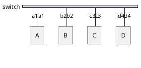

# Switch

A switch is a [[2. Data Link|layer 2]] device whose primary purpose is switching, i.e. moving data **within** networks.
Devices communicating through a switch are in the same network.

## How Do Switches Facilitate Communication?

Switches use and maintain a MAC address table. It maps the switch ports to specific MAC addresses. 
Let's say we have a switch with hosts connected to its ports:

Initially, the MAC address table starts out empty:

| Port | MAC |
| --- | --- |

It populates the table as data flows. Switches perform these 3 tasks:
- **Learn** - update MAC table with map of port & source MAC.
- **Flood** - duplicate and send frame out all ports (except the initial port that received the frame).
- **Forward** - use MAC table to deliver the frame through the appropriate port.
So, if A sends data to D, it **learns** that a1a1 is connected to port 1, thus updating the MAC table:

> Every switch uses a different numbering scheme for its ports. Here, for simplicity, numbers 1-4 are used respectively.

| Port | MAC |
| --- | --- |
| 1 | a1a1 |

But now, it doesn't know anything about d4d4. To find out, it **floods** - duplicates and sends the frame through all ports. The hosts now take a look at the destination address. Since B & C are not the recipients of the frame, they're going to discard it. But D will accept the frame.
Since D will have to send a response, it also populates the switch's MAC table port in the same way as A did:

| Port | MAC |
| --- | --- |
| 1 | a1a1 |
| 4 | d4d4 |

The switch now has to figure out what to do with the frame from D. It'll look at the destination MAC which is a1a1, and determine where to send the frame. The difference now is that it already has the relevant port in the table. So, all it has to do now is **forward**.

To note, this was us sending data **through** the switch, so we didn't use its MAC address at all. If we wanted to send data **to** the switch, we'd use its MAC, and the switch would also need an IP address. But that, essentially, would make it a host itself.